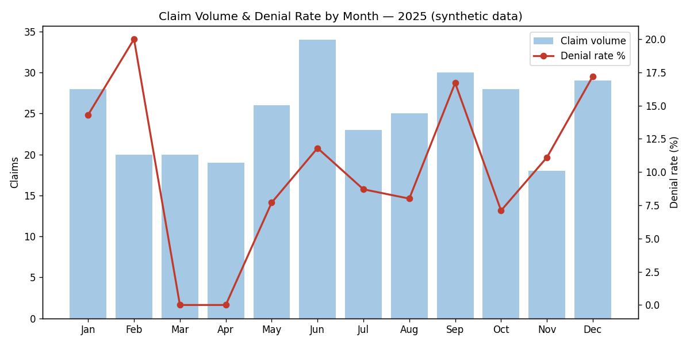

# Healthcare BI Pipeline: Claims ETL & Star-Schema Warehouse

**End-to-end business intelligence workflow — from messy source extracts to a dimensional warehouse and executive KPIs.**



## Overview

Revenue-cycle leaders ask the same questions every month: *what's our denial rate, which payers are holding dollars, and where is volume coming from?* Answering them reliably requires more than queries — it requires a modeled warehouse where every report agrees on the numbers.

This project implements that full BI workflow on synthetic healthcare claims data:

1. **Extract** — three raw source files (claims, encounters, providers) simulating real payer/EHR extracts, complete with realistic quality problems: duplicate claims, inconsistent status casing, missing payer values
2. **Transform** — data-quality rules plus dimensional modeling into a Kimball-style star schema (`fact_claims` + 4 dimensions)
3. **Load** — SQLite warehouse plus CSV exports of every table so the model is browsable right here on GitHub
4. **Analyze & Share** — five stakeholder KPI queries and an auto-generated denial-rate trend chart

> All data is synthetic and reproducible (seeded RNG). No PHI anywhere in this repository.

## Why this design

I built the schema around the questions the business actually asks, not around the source files. Denied claims stay in the fact table as first-class rows with an `is_denied` flag — because denial analysis *is* the use case, and pre-computing the flag means every analyst's denial rate matches. Full rationale in [docs/data_model.md](docs/data_model.md), including the ER diagram.

My background supporting insurance systems shaped the data-quality rules: duplicate claim submissions and payer-name gaps aren't hypothetical — they're what real extracts look like.

## Repository structure

```
healthcare-bi-pipeline/
├── data/raw/            # Source extracts (generated, intentionally messy)
├── etl/
│   ├── generate_source_data.py   # Seeded synthetic source data
│   ├── run_etl.py                # Extract → Transform → Load
│   └── build_dashboard_chart.py  # KPI chart for reporting
├── warehouse/           # Loaded star schema (CSV per table + SQLite)
├── sql/kpi_queries.sql  # 5 business KPI queries with commentary
└── docs/data_model.md   # ER diagram + design decisions
```

## Key results (from the loaded warehouse)

Monthly denial rates range from roughly 5% to 19% across 2025, with **Medicare holding the largest dollars-at-risk (~$1,400 denied of ~$11,400 billed)**. "Non-covered service" is the costliest denial reason. Every number is reproducible by running the pipeline.

## How to run

```bash
pip install pandas matplotlib
python etl/generate_source_data.py   # create raw source extracts
python etl/run_etl.py                # build the warehouse
python etl/build_dashboard_chart.py  # generate the KPI chart
```

Then run any query from `sql/kpi_queries.sql` against `warehouse/healthcare_dw.db`.

## Skills demonstrated

ETL design (extract/transform/load separation) · dimensional modeling (star schema, surrogate keys, date dimension) · data-quality engineering (dedup, conforming, null handling) · KPI development for revenue-cycle stakeholders · Python (pandas) · SQL · SQLite

## About

Part of my healthcare analytics portfolio — built to apply the Google Business Intelligence certificate to the insurance-billing domain I know from years of healthcare IT support.

📫 elazarferrer1@gmail.com · [Profile](https://github.com/elazarf123)
