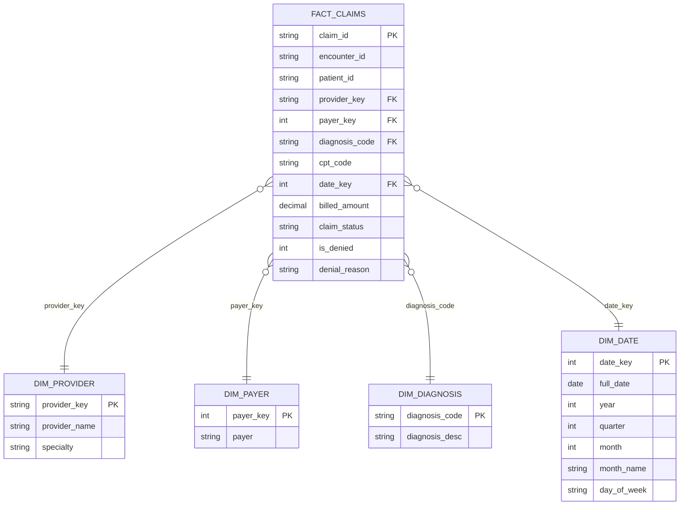

# Data Model — Healthcare Claims Star Schema

The warehouse uses a classic Kimball-style star schema: one fact table at the
claim grain, surrounded by conformed dimensions.

## Design decisions

**Grain.** One row per claim. Denials are kept as rows (with `is_denied` flag
and `denial_reason`) rather than filtered out — denial analysis is a primary
use case, so denied claims are first-class facts.

**`is_denied` as a fact flag.** Pre-computing the binary flag keeps KPI SQL
simple (`SUM(is_denied)/COUNT(*)`) and consistent across every report instead
of each analyst re-deriving it from `claim_status` strings.

**Date dimension with integer key (YYYYMMDD).** Standard warehouse pattern:
compact joins, human-readable keys, and month/quarter/day-of-week attributes
available without date functions in every query.

**Payer surrogate key.** Payer names arrive dirty from the source (missing
values ~3%). Conforming them once into `dim_payer` (with an `Unknown` member)
means every downstream report treats payers identically.

## Data quality rules applied in Transform

| Rule | Source issue | Handling |
|---|---|---|
| Deduplicate on `claim_id` | Duplicate claim submissions | Keep first occurrence |
| Standardize `claim_status` | `paid` / `Paid` / `PAID` | Title-case normalization |
| Missing payer | Blank strings in extract | Mapped to `Unknown` payer member |
| Amount validation | Text-typed amounts | Coerced to numeric; invalid → 0.00 |
